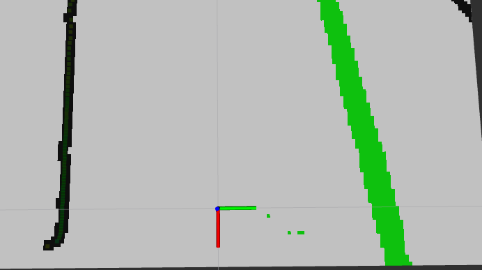
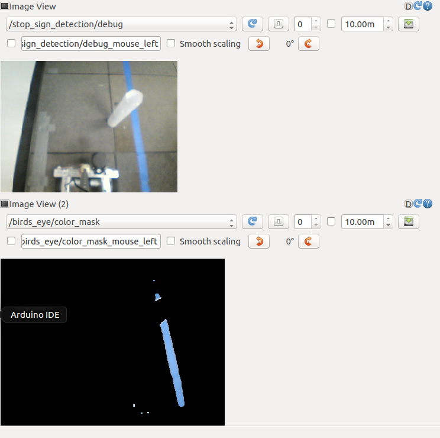
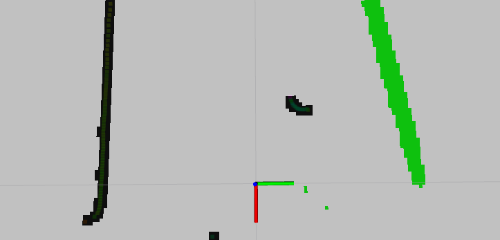
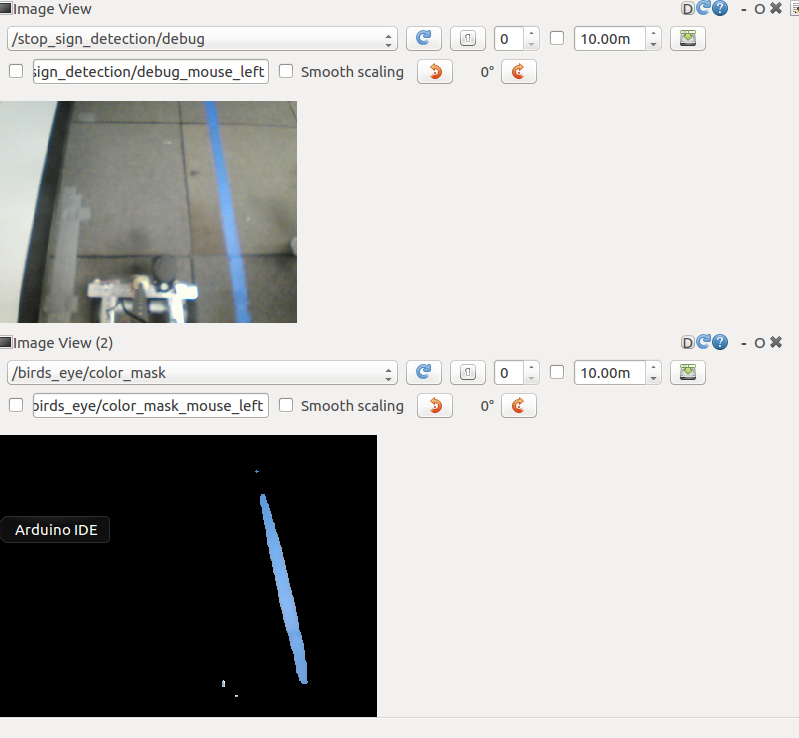
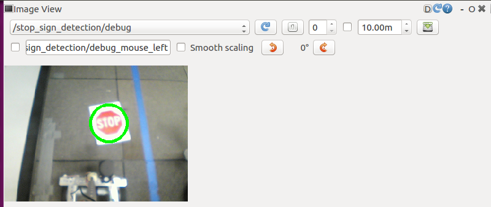

TERM PROJECT

- Term Project is a Lane follow program which makes the robot to run in a specified path and should spin on first stop sign it detects and stop for the second stop sign. The robot should avoid the obstacles infront of it. The path here is between wall and blue tape.

- For this project we make use of occupancy grid which is built in birds eye program. To built this occupancy grid, we merge the images which is captured from camera and lidar. The image captured by camera will be the blue tap, which will be coverted to green pixel in rviz. The lidar image here will be the wall and obstacles in front of the robot, whose pixel values will be black.

- The algorithm used to accomplish this task is to check for blue tape on each move of the robot. The frame captured by the camera will be divided into four columns(column 1, 2, 3, 4 respectively). Colour pixels and green pixels for each column will be calculated using a counter variable and stored into corresponding array. 

- Initially, the value of green pixel will be checked, by searching which column has maximum number of pixel. If the value is maximum for right side, then it means that the robot should now check for colour pixel values in middle two column, if column 2 has maximum, then robot should turn right, else it should turn left. If the value of green pixel becomes less i.e approximately less than 10 -20 pixels, it means that the robot has reached the corner and it's time for it to take a turn. Since, we had seen that green pixel was maximum  at right, the robot should take a right turn until its sees green tape. This process is repeated, but oppositely when the robot sees green pixel maximum on left side.

- On the process of the above procedure, we will be checking if  is any obstacle in front it. This is done by checking the angle in which the lidar points on obstacle. If the angle value is inbetween 95 to 175, the robot takes a turn to it's left , if it's inbetween 185 to 270, the robot takes a turn to it's right.

- The next step is to check if there is any "stop sign" being detected. If the robot detects a stop sign and if it's the first sign it detects, then the robot will spin 180 degree and starts again with it's run. If it detects for second time the the robot will stop.

Images

Image:

>Occupancy grid 

>Rqt image with obstacle

>Rqt without Stop sign 

>Rqt with Stop sign 

